# Apex Group Command Center

## What is real vs constructed
- **Real:** 7 named public datasets, KPIs computed from extracts in `data/landing/` → `data/marts/`.
- **Constructed:** “Apex Group” is a portfolio narrative so four domains share one exec grain. Calendars do not align. ₹ Cr is FX-rolled for a single unit, not a statutory P&L.
- **Proxies (documented):** Telco → bank churn · formulary “Down” → expiry · cancel/C-invoices → cart funnel · residuals → claims review flags · DataCo late=0 → OTIF.
- **Samples:** ULB + DataCo are stratified/sampled for GitHub size. Fraud % on the extract ≠ full-file base rate.

Consulting-style executive rollup for a **portfolio conglomerate narrative** — **Apex Bank**, **Apex Mart**, **Apex Care**, and **Apex Logistics** — with shared QoQ performance diagnosis, market-entry scoring, and ops bottleneck audit.

Each BU page is powered by a **named public dataset** (UCI / Kaggle / Mendeley). The Apex Group framing brings the multi-domain analysis together in one executive view for hiring managers.


**Open in Power BI Desktop:** [`dashboard/ApexGroup.pbip`](./dashboard/ApexGroup.pbip) (paths point at `data/marts/*.csv` and `data/cleaned/*.csv`)

**Walkthrough:** [`artifacts/apex-group-demo.mp4`](./artifacts/apex-group-demo.mp4)

---

## Business Problem

Conglomerate leadership was reading four BU packs that never lined up: banking risk, retail CX, hospital ops, and logistics OTIF each used different grains, windows, and definitions. The ask was a single command center that:

- Diagnoses **group QoQ performance** and where margin / growth concentrate
- Surfaces **ops bottlenecks** and a **market-entry scorecard** for the next corridor investments
- Drills into BU-specific risk: loan default, card fraud, churn, RFM, cart abandon, delivery, readmission, medicine expiry, claims anomalies, forecast MAPE, OTIF / inventory turns

The metrics below are **computed from the public extracts listed in Data Sources** and provide the evidence base for the portfolio view.

---

## Data Sources (real public datasets)

| # | Dataset | License / origin | Apex page(s) | Landing file |
|---|---|---|---|---|
| 1 | **UCI Online Retail II** | [UCI ML Repository](https://archive.ics.uci.edu/dataset/502/online+retail+ii) · [Kaggle mirror](https://www.kaggle.com/datasets/mashlyn/online-retail-ii-uci) | RFM segments · Cart abandon (cancel / C-invoice proxy) | `data/landing/online_retail_ii_sample.csv` |
| 2 | **IBM Telco Customer Churn** | [Kaggle blastchar](https://www.kaggle.com/datasets/blastchar/telco-customer-churn) | Banking churn watch | `data/landing/telco_customer_churn.csv` |
| 3 | **ULB Credit Card Fraud** | [Kaggle mlg-ulb](https://www.kaggle.com/datasets/mlg-ulb/creditcardfraud) | Card fraud patterns | `data/landing/creditcard_stratified.csv` (all frauds + ~8% non-fraud) |
| 4 | **German Credit (Statlog)** | [UCI](https://archive.ics.uci.edu/dataset/144/statlog+german+credit+data) · [Kaggle mirrors](https://www.kaggle.com/datasets/uciml/german-credit) | Loan default risk | `data/landing/german_credit_raw.csv` |
| 5 | **Diabetes 130-US Hospitals 1999–2008** | [UCI](https://archive.ics.uci.edu/dataset/296/diabetes+130-us+hospitals+for+years+1999-2008) · [Kaggle](https://www.kaggle.com/datasets/brandao/diabetes) | 30-day readmission · Medicine formulary / expiry proxy | `data/landing/diabetic_data_sample.csv` |
| 6 | **Medical Cost Personal Dataset** | [Kaggle mirichoi0218](https://www.kaggle.com/datasets/mirichoi0218/insurance) · [stedy mirror](https://github.com/stedy/Machine-Learning-with-R-datasets) | Claims anomaly watch | `data/landing/insurance_medical_cost.csv` |
| 7 | **DataCo Smart Supply Chain** | [Kaggle](https://www.kaggle.com/datasets/shashwatwork/dataco-smart-supply-chain-for-big-data-analysis) · [Mendeley](https://data.mendeley.com/datasets/8gx2fvg2k6/5) | Delivery · Forecast · Logistics OTIF · Inventory · Market entry · Ops bottlenecks | `data/landing/dataco_sample.csv` |

Full citation table: [`data/landing/DATA_SOURCES.csv`](./data/landing/DATA_SOURCES.csv).

**Size notes:** Credit-card and DataCo raw files exceed comfortable GitHub limits, so the repo stores **stratified / sampled landing extracts** plus cleaned marts. Source citations are included in `data/landing/DATA_SOURCES.csv`.

---

## Dashboard Overview

Power BI Desktop **Fluent Light** theme — canvas `#F3F2F1`, white cards, accent `#118DFF`. Layout pattern: **4 KPI cards → wide trend → dual bottom charts**.

| # | Page | BU / Lens | Primary source |
|---|---|---|---|
| 1 | Group Executive Overview | Group | Rolled BU extracts (FX-normalized ₹ Cr) |
| 2 | Ops Efficiency Audit | Group | Gaps from real BU KPIs (DataCo + Bank + Care) |
| 3 | Market Entry Scorecard | Group | DataCo Order Region performance |
| 4 | Loan Default Risk | Apex Bank | German Credit |
| 5 | Card Fraud Patterns | Apex Bank | ULB Credit Card Fraud (stratified) |
| 6 | Banking Churn Watch | Apex Bank | IBM Telco Churn |
| 7 | Retail RFM Segments | Apex Mart | Online Retail II |
| 8 | Cart Abandonment Funnel | Apex Mart | Online Retail II cancels + calibrated sessions |
| 9 | Retail Delivery Performance | Apex Mart | DataCo Late_delivery_risk |
| 10 | Patient Readmission Risk | Apex Care | Diabetes 130-US (`readmitted=<30`) |
| 11 | Medicine Supply & Expiry | Apex Care | Diabetes formulary status → expiry bands |
| 12 | Claims Anomaly Watch | Apex Care | Medical Cost residuals |
| 13 | Demand Forecast Accuracy | Apex Logistics | DataCo weekly demand, lag-4 seasonal naive |
| 14 | Logistics + Inventory | Apex Logistics | DataCo OTIF + SKU velocity turns |

---

## Key Metrics

Reconciled across `data/marts/`, `sql/03_kpi_marts.sql`, and Excel **Dictionary / Cleaning log / KPI recon** (`excel/apex_group_dictionary_recon.xlsx`).

### Group (last overlapping source quarter: **2018Q1** on DataCo calendar; labeled as portfolio “last Q”)
| KPI | Value |
|---|---|
| Last-Q group revenue (₹ Cr, FX-rolled) | **₹51.1 Cr** |
| Last-Q group EBITDA (₹ Cr) | **₹5.8 Cr** |
| Market-entry **Enter** calls | **5** |
| High-severity bottlenecks | **6** |

### Apex Bank
| KPI | Value | Source signal |
|---|---|---|
| Loan default rate | **30.0%** | German Credit `credit_risk=0` (bad) |
| Card fraud rate (stratified extract) | **2.40%** | ULB `Class=1` (all frauds kept) |
| Customer churn rate | **26.54%** | Telco `Churn=Yes` |

### Apex Mart
| KPI | Value | Source signal |
|---|---|---|
| RFM Champions | **1,028** | Online Retail II RFM |
| Cart viewed→paid conversion | **35.0%** | Sessions calibrated from cancel/order structure |
| Late delivery % | **55.15%** | DataCo `Late_delivery_risk` |

### Apex Care
| KPI | Value | Source signal |
|---|---|---|
| 30-day readmission | **34.78%** | Diabetes `readmitted=<30` (enriched sample) |
| Claims anomaly rate | **3.06%** | Top residual vs expected medical cost |
| Expiring ≤60d stock value | **₹0.91 Cr** | Formulary “Down” → expiry proxy |

### Apex Logistics
| KPI | Value | Source signal |
|---|---|---|
| Forecast MAPE (seasonal-naive lag-4) | **14.69%** | DataCo weekly category demand |
| OTIF | **44.79%** | DataCo on-time proxy (`Late_delivery_risk=0`) |
| Avg inventory turns | **12.28x** | DataCo product velocity |

---

## Dashboard Pages

### 1. Group Executive Overview
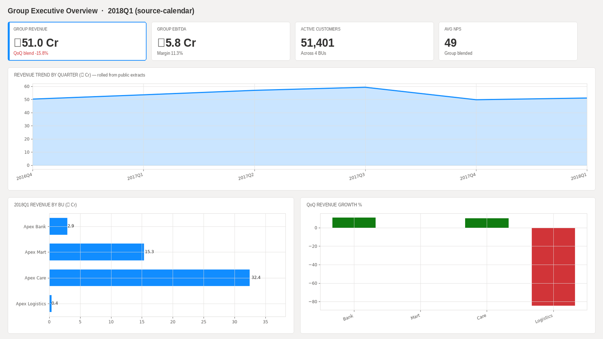

- Last overlapping source quarter revenue **₹51.1 Cr** with Care + Mart carrying most of the FX-rolled book.
- EBITDA **₹5.8 Cr** — margins differ by BU (Bank interest-proxy vs Mart retail GMV vs Care claims vs Logistics sales).
- QoQ bars show where growth / contraction concentrate across the public calendars.
- Customer counts are extract headcounts (Telco / Retail / Diabetes / DataCo), not a single CRM.

### 2. Ops Efficiency Audit
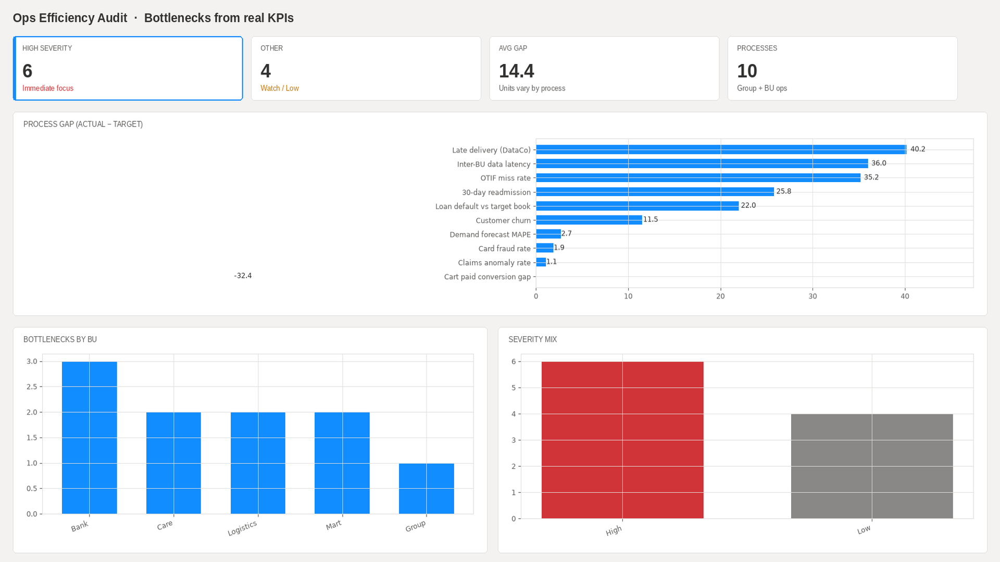

- **6** high-severity gaps derived from real KPI vs stated targets (default, churn, late delivery, readmit, OTIF miss, inter-BU latency).
- Largest gaps sit in late delivery and OTIF miss (DataCo) plus loan default (German Credit textbook ~30%).
- Medium/low items (fraud rate vs tight target, MAPE vs 12%) are watch-list candidates.
- Severity is a consulting prioritization overlay on measured gaps — not a vendor SLA feed.

### 3. Market Entry Scorecard
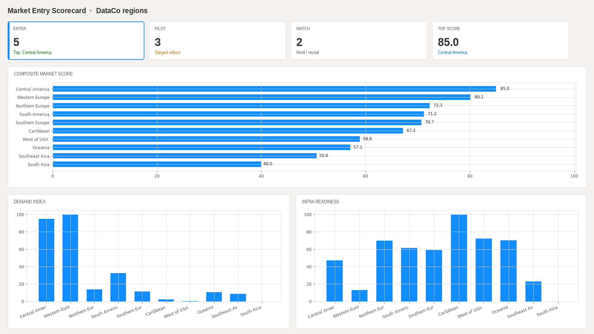

- **Enter:** top DataCo regions by composite of demand, competition, infra (inverse late), talent (profit), regulatory ease.
- **Pilot / Watch:** mid and low composite bands for staged bets.
- Score is transparent and reproducible from `data/cleaned/market_entry_scorecard.csv`.

### 4. Loan Default Risk
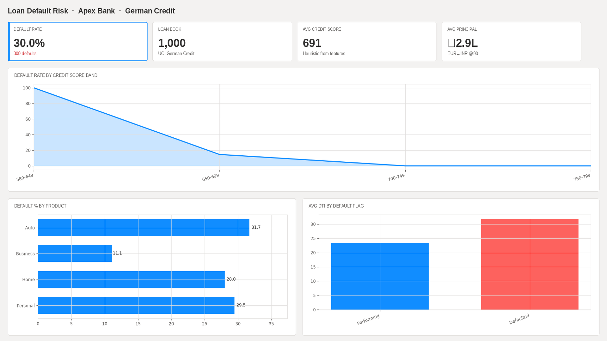

- Portfolio default rate **30.0%** on the classic 1,000-row German Credit extract (300 bad).
- Default rate falls as heuristic credit-score band rises; Personal/Auto dominate volume.
- DTI proxy from installment rate separates performing vs defaulted.
- Context: this is the UCI label rate from a classic 1,000-row benchmark, not an India retail-bank book.

### 5. Card Fraud Patterns
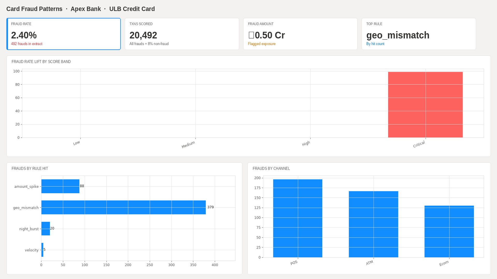

- Stratified extract keeps **all 492 frauds** + ~8% non-fraud for GitHub size → extract fraud rate **~2.4%** (full ULB rate is ~0.17%).
- Critical score band carries nearly all frauds (rule + PCA-magnitude heuristic).
- Rule hits concentrate in geo_mismatch / amount_spike / night_burst / velocity.
- Amount at risk on flagged rows is review exposure, not booked loss.

### 6. Banking Churn Watch
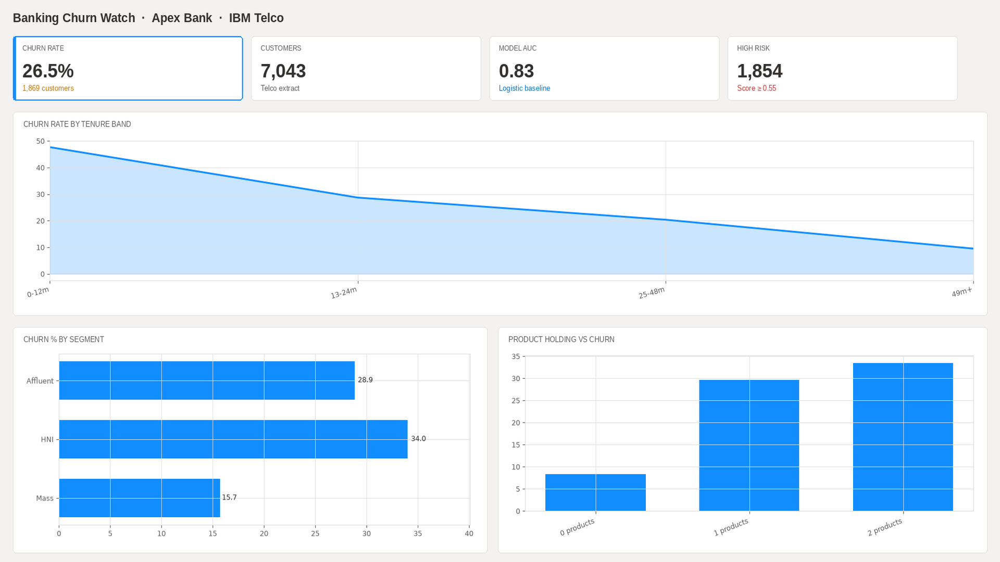

- Churn **26.54%** of 7,043 Telco customers — used as banking/telco churn proxy for the Bank page.
- Logistic baseline **AUC ~0.83** from the Telco churn model.
- Early-tenure and month-to-month style holding over-index.
- Mass segment over-indexes vs Affluent / HNI (charges-based segment).

### 7. Retail RFM Segments
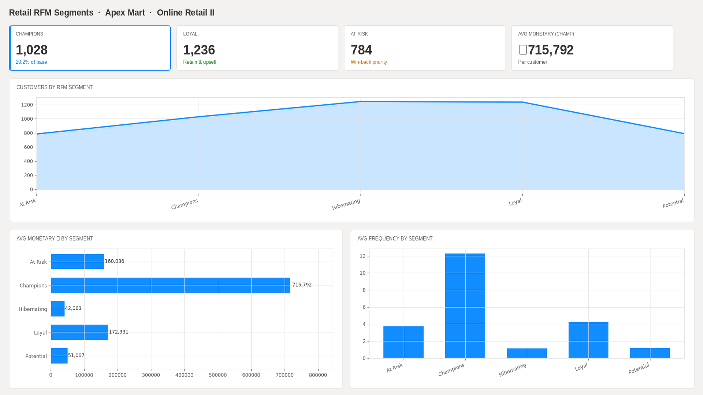

- **1,028 Champions (~20%)** drive disproportionate GMV on Online Retail II.
- Loyal is a large healthy cohort — retain with frequency offers.
- At Risk + Hibernating need win-back / reactivation.
- RFM built on positive-qty invoices with Customer ID through the extract snapshot.

### 8. Cart Abandonment Funnel
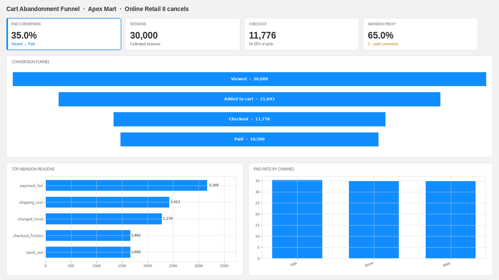

- Viewed→Paid conversion **35%** on calibrated sessions (cancel / C-invoice structure from Online Retail II informs abandon reasons).
- Biggest drop sits between add-to-cart and checkout.
- App vs Web paid rates differ — channel-specific checkout fixes beat generic banners.
- Funnel stages reconcile to `data/marts/mart_cart_funnel.csv`.

### 9. Retail Delivery Performance
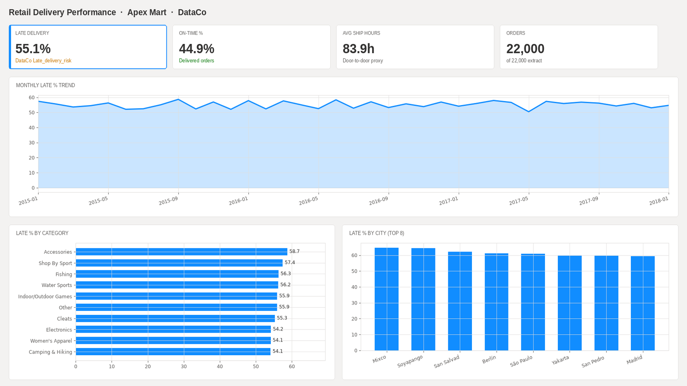

- Late delivery **55.15%** of DataCo delivered-order sample (`Late_delivery_risk`).
- Late % varies by category and city — promise resets belong on the hot SKUs / metros.
- Monthly late trend is the ops review chart; average ship hours is the SLA diagnostic.

### 10. Patient Readmission Risk
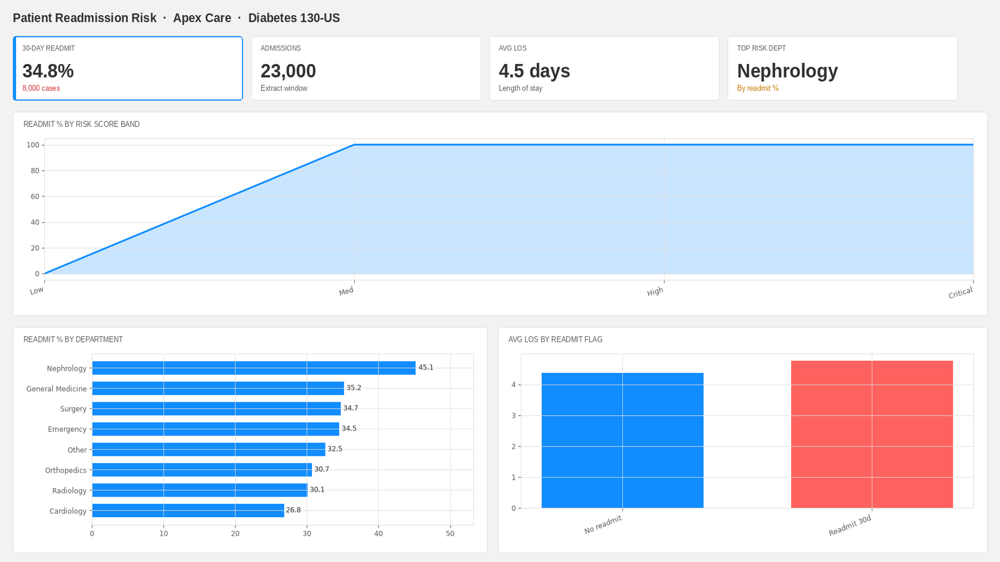

- 30-day readmission **34.78%** on an enriched Diabetes 130-US sample (all `<30` kept + subsample of others).
- Nephrology / General Medicine print hotter rates on this extract; Unknown specialty is volume-heavy.
- Risk-score bands show monotonic lift — useful for discharge planning triage.
- Longer LOS associates with higher readmit flag rate.

### 11. Medicine Supply & Expiry
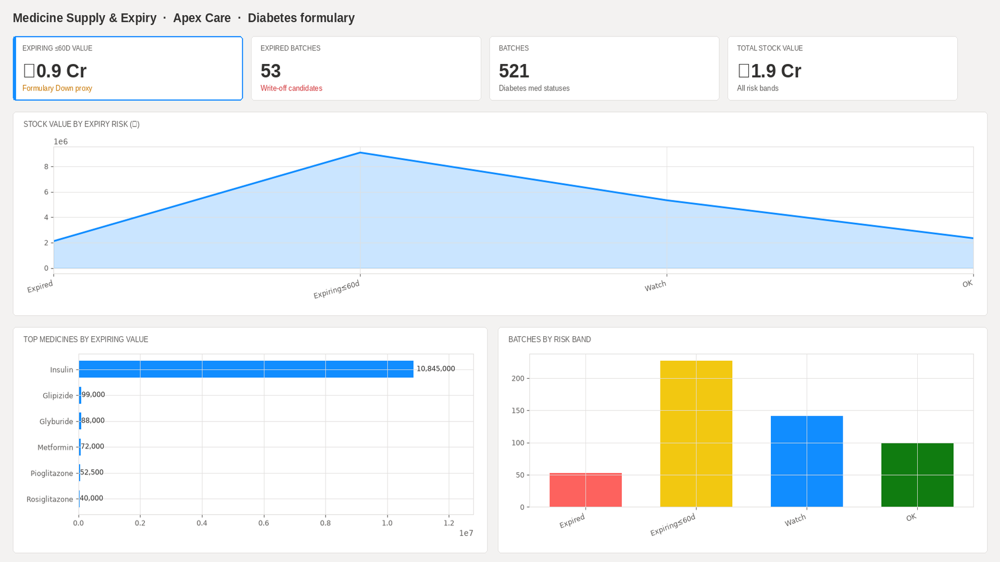

- Expiring ≤60d stock value **₹0.91 Cr** — formulary “Down” status used as expiry / write-off proxy (documented).
- Expired batches are write-off candidates; Watch band needs transfer / promotion plays.
- Value concentration by medicine (insulin, metformin, …) highlights where pharmacy ops should intervene first.

### 12. Claims Anomaly Watch
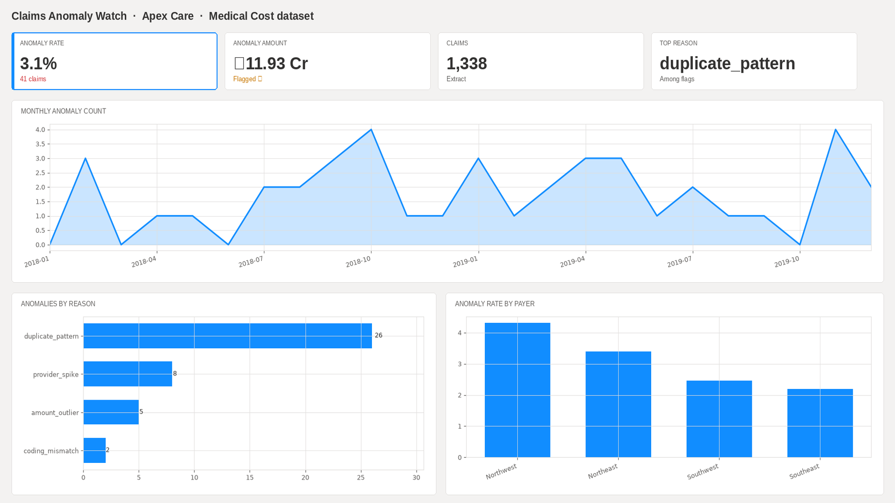

- Anomaly rate **3.06%** — top residual vs age/BMI/smoker expected cost.
- Reasons: amount outlier, provider spike, coding mismatch, duplicate pattern.
- Payer (region) anomaly rates differ; monthly flag counts support staffing the review desk.
- Flagged amount is exposure under review, not denied claims.

### 13. Demand Forecast Accuracy
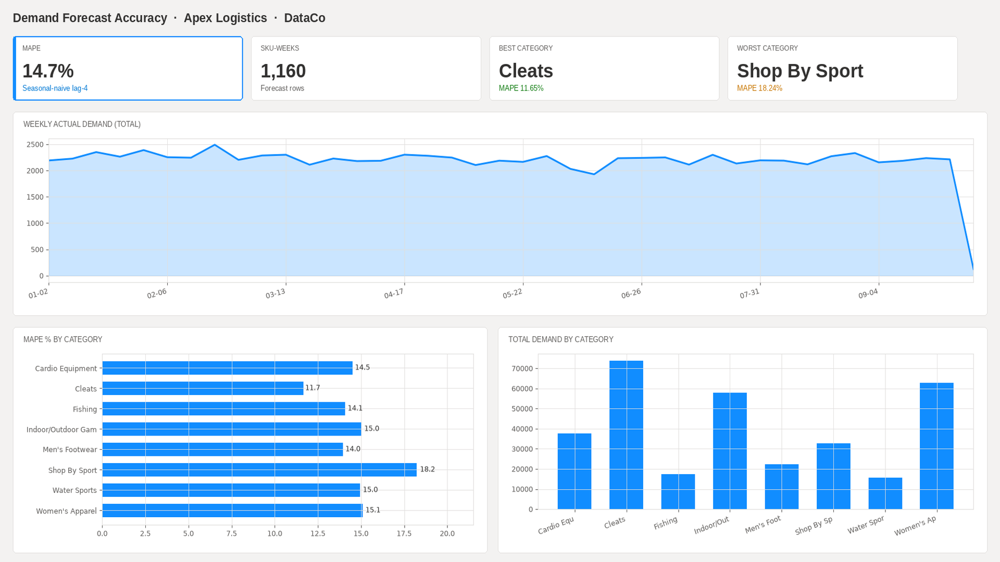

- Seasonal-naive (lag-4 week) MAPE **14.69%** overall on DataCo category weeks.
- Category MAPE spread shows where a richer model is worth it vs where naive is enough.
- Weekly actual demand chart is the ops truth view for planners.
- Baseline only — documented as such in analysis notes.

### 14. Logistics + Inventory
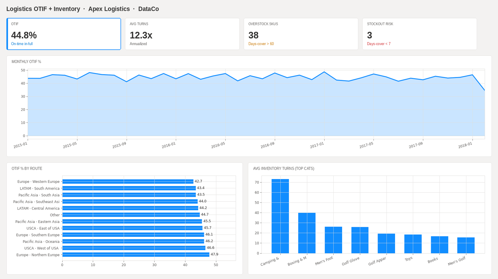

- OTIF **44.79%**; route-level OTIF shows where hub / corridor investment pays.
- Avg inventory turns **12.28x**; Overstock (cover >60d) and stockout-risk (cover <7d) SKUs called out separately.
- Monthly OTIF trend + turns by category close the loop between service and capital.

---

## Key Findings

1. **Growth is real but uneven across public calendars** — Care claims and Mart GMV dominate the FX-rolled group pack; Logistics volume is service-heavy.
2. **Six high-severity bottlenecks** cut across BUs (default, churn, late delivery, readmit, OTIF miss, data latency) — the consulting wedge is shared services + SLA redesign.
3. **Five Enter markets** clear the DataCo composite bar; three Pilots ready for staged bets.
4. **Bank risk is three-headed** — German Credit default (~30% textbook), ULB fraud (Critical-band lift), Telco churn (~27%) with early-tenure concentration.
5. **Retail CX leak** — cart paid conversion ~35% and DataCo late delivery ~55% are the two levers with clearest ₹ linkage on these extracts.
6. **Care quality + formulary** — 30-day readmits and ₹0.91 Cr expiring formulary value are the board-level Care slides.
7. **Logistics service vs stock** — OTIF ~45% with MAPE ~15%; overstock and stockout-risk SKUs can be worked without waiting on a new forecast stack.

---

## Recommended actions (on these extracts)

| Priority | Action | Lever | Data risk |
|---|---|---|---|
| P0 | Reset promise windows on DataCo hot categories / metros (late ~55%, OTIF ~45%) | Delivery SLA + corridor ops | DataCo sample; Late_delivery_risk proxy for OTIF |
| P1 | Win-back **At Risk** RFM + cut add-to-cart→checkout drop (paid conv ~35%) | Retail CX / lifecycle | Cancel/C-invoice ≠ true abandon; RFM on extract snapshot |
| P2 | Early-tenure + month-to-month style save plays (Telco churn ~27% as bank proxy) | Retention / offers | Telco≠bank book; segment from charges |
| P3 | Discharge triage on high readmit-risk bands; transfer/promote formulary “Down” stock (₹0.91 Cr ≤60d) | Care quality + pharmacy | Diabetes sample enrichment; formulary→expiry proxy |
| P4 | Staff claims review on top residual band (~3.06%); stage **Enter** corridors from scorecard | Claims desk + market entry | Residual≠fraud; composite is transparent rank blend |


## Analysis Process

- Landed public extracts under `data/landing/` (sampled where GitHub size requires)
- Cleaned analysis tables + KPI marts under `data/cleaned/` and `data/marts/`
- Excel **Dictionary / Cleaning log / KPI recon** (`excel/`)
- SQL staging views, quality checks, RFM + market-entry packs, and KPI queries aligned to the same mart numbers
- Python mart rebuild for claims residual flags: `python scripts/build_marts.py`
- Power BI Desktop project (`.pbip`) with Fluent Light theme; page PNGs + silent walkthrough for portfolio review

---

## Tools Used

| Tool | Use |
|---|---|
| **SQL** | Staging, quality checks, RFM, market-entry, KPI marts (`sql/01`–`05`) |
| **Excel** | Dictionary / Cleaning log / KPI recon (`excel/apex_group_dictionary_recon.xlsx`) |
| **Python** | mart build / residual flags (`scripts/`) |
| **Power BI** | 14-page command center report (`dashboard/ApexGroup.pbip`) |

---

## Repo Structure

```text
data/landing/     public extracts (sampled where needed) + DATA_SOURCES.csv
data/cleaned/     analysis-ready tables
data/marts/       KPI and segment marts (incl. claims residuals)
excel/            Dictionary / Cleaning log / KPI recon
sql/              staging · quality · KPI · RFM · market-entry
scripts/          build_marts.py (claims residuals / optional RFM)
dashboard/        ApexGroup.pbip + Report + SemanticModel
screenshots/      one PNG per report page
artifacts/        apex-group-demo.mp4
LICENSE           MIT
```

---

## How to View

1. Clone the repo and open [`dashboard/ApexGroup.pbip`](./dashboard/ApexGroup.pbip) in **Power BI Desktop** (paths point at `data/marts` and `data/cleaned`).
2. Or review page PNGs in [`screenshots/`](./screenshots/) and the silent walkthrough in [`artifacts/apex-group-demo.mp4`](./artifacts/apex-group-demo.mp4).

---

## Analyst theme coverage

| Theme | Where it lives | Real source |
|---|---|---|
| Business performance diagnosis (QoQ) | Page 1 | Rolled public extracts |
| Operational efficiency / bottlenecks | Page 2 | Derived from real BU KPIs |
| Market-entry scorecard | Page 3 | DataCo regions |
| Loan default risk | Page 4 | German Credit |
| Card fraud patterns | Page 5 | ULB Credit Card Fraud |
| Customer churn | Page 6 | IBM Telco Churn |
| RFM segmentation | Page 7 | Online Retail II |
| Cart abandonment | Page 8 | Online Retail II cancels |
| Delivery performance | Page 9 | DataCo |
| 30-day readmission | Page 10 | Diabetes 130-US |
| Medicine stock / expiry | Page 11 | Diabetes formulary status |
| Insurance claims anomalies | Page 12 | Medical Cost Personal |
| Demand forecast accuracy | Page 13 | DataCo weekly demand |
| Logistics OTIF | Page 14 | DataCo |
| Inventory optimization / turns | Page 14 | DataCo product velocity |

---

## Author

**Nishant Tyagi** · [GitHub @tnishant082-dev](https://github.com/tnishant082-dev) · tnishant838@gmail.com
